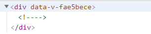
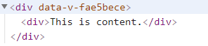
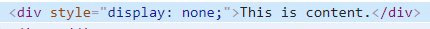
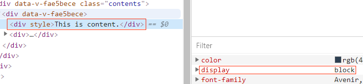
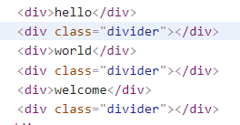

# 关于Vue和React的一些对比及个人思考（中）
Vue和React都是目前最流行、生态最好的前端框架之一。框架本身没有优劣之分，只有适用之别，选择符合自身业务场景、团队基础的技术才是我们最主要的目的。

中部将主要从以下几个方面进行比较。
## 9.条件渲染(v-if vs &&)
条件渲染用于根据条件判断是否渲染一块内容。
### vue
vue中用`v-if`指令条件性地渲染一块内容。只有当表达式返回真值时才被渲染，`v-if`还可以和`v-else-if`、`v-else`配合使用，用于不同条件下的渲染，类似js里的`if else`语法。

#### （1）基本用法
```
 <div v-if="showContent">This is content.</div>
```
data
```
  data() {
    return {
      showContent: false
    }
  }
```
当showContent为false时，不会渲染DOM节点，会留下一个注释标志。



showContent为true时，才会渲染DOM节点。



#### （2）`v-else`二重判断
`v-if`和`v-else`配合使用时，`v-else`必须要和`v-if`相邻，否则会报错。
```
  <div>
    <div v-if="showContent">This is content.</div>
    <div v-else>Hide content.</div>
  </div>
```
#### （3）`v-else-if`多重判断
当有多重判断条件时，可以使用`v-else-if`，类似`v-if`的`else-if块`，v-else 元素必须紧跟在带 v-if 或者 v-else-if 的元素的后面，否则它将不会被识别。
```
<div v-if="type === 'A'">
  A
</div>
<div v-else-if="type === 'B'">
  B
</div>
<div v-else-if="type === 'C'">
  C
</div>
<div v-else>
  Not A/B/C
</div>
```
#### （4）`<template>`使用`v-if`
另外，当想切换多个元素时，在`<template>`上使用`v-if`可以针对元素进行分组。
```
<template v-if="ok">
  <h1>Title</h1>
  <p>Paragraph 1</p>
  <p>Paragraph 2</p>
</template>
```
### react
react使用与运算符`&&`、三目运算符、`if else`来实现条件渲染的效果。
#### (1)与运算符
与运算符`&&`，实现效果类似`v-if`，左边变量为真值时，渲染右边的元素。
```
 return (
      <div>
        {showItem && <div>This is content.</div>}
      </div>
    );
```
#### （2）三目运算符
使用三目运算符，实现类似`v-if v-else`效果。
```
 return (
      <div>
        {
          showItem ?
            (<div>This is true content.</div>) : (<div>This is false content.</div>)
        }
      </div>
    );
```
#### （3）多重判断
当处理多重判断时，可以使用函数加`if else`多重判断或者`switch case`的形式来实现，实现类似`v-if v-else-if v-else`的效果。

Ⅰ.`if-else`多重判断
```
render() {
    const { type } = this.state;
    const toggeleShow = (type) => {
      if (type === 'A') {
        return <div>A</div>;
      } else if (type === 'B') {
        return <div>B</div>;
      } else if (type === 'C') {
        return <div>C</div>;
      } else {
        return null;
      }
    };

    return (
      <div>
        {toggeleShow(type)}
      </div>
    );
  }
```
Ⅱ.`switch case`实现多重判断
```
render () {
    const { type } = this.state;
    const toggeleShow = (type) => {
      switch (type) {
        case 'A':
          return <div>A</div>;
        case 'B':
          return <div>B</div>;
        case 'C':
          return <div>C</div>;
        default:
          return null;
      }
    };

    return (
      <div>
        {toggeleShow(type)}
      </div>
    );
  }
```
## 10.是否显示(v-show vs style+class)
另一个用于展示条件的元素的选项是`v-show`，react中可以通过`style`或者切换`class`的形式实现是否显示。
### vue
`v-show`渲染的元素会被渲染并保留在DOM中。`v-show`只是简单地切换元素的css属性`display`。
```
 <div v-show="showContent">This is content.</div>
```

`showContent`为`false`时，`style`的`display`属性值为`none`。



`showContent`为`true`时，`style`的`display`属性值为`block`（元素默认`display`属性值）。



> 注意，v-show 不支持 `<template>` 元素，也不支持 v-else。

v-if与v-show对比总结：
- 1）v-if 是“真正”的条件渲染，因为它会确保在切换过程中条件块内的事件监听器和子组件适当地被销毁和重建。
- 2）v-if 也是惰性的：如果在初始渲染时条件为假，则什么也不做——直到条件第一次变为真时，才会开始渲染条件块。
- 3）相比之下，v-show 就简单得多——不管初始条件是什么，元素总是会被渲染，并且只是简单地基于 CSS 进行切换。
- 4）一般来说，v-if 有更高的切换开销，而 v-show 有更高的初始渲染开销。因此，如果需要非常频繁地切换，则使用 v-show 较好；如果在运行时条件很少改变，则使用 v-if 较好。

### react
react中通过修改style或者class来实现v-show类似效果。

通过修改style属性的display属性来实现切换是否显示。
```
<div style={{ display: showItem ? 'block' : 'none' }}>
        This is content.
</div>
```
通过变量判断修改`class`来实现切换效果，本质上也是切换元素的`display`属性来实现切换效果。
> 在`react`中动态修改元素样式时（比如切换`tab`、按钮选中状态），适用于使用`class`来实现。
```
 const itemClass = showItem ? 'show-item-class' : 'hide-item-class';
    return (
      <div className={itemClass}>
        This is content.
      </div >
    );
```
class样式：
```
.show-item-class {
  display: block;
}
.hide-item-class {
  display: none;
}
```
## 11.列表渲染(v-for vs map)
vue中使用`v-for`来渲染列表，react中使用`map`来渲染列表。不管是`v-for`还是`map`来渲染列表都需要添加`key`值（`key`在兄弟节点之间必须唯一），方便快速比较出新旧虚拟`DOM`树间的差异。
### vue
vue中可以使用`v-for`来渲染数组、对象、`<template>`、组件。

#### （1）渲染数组
渲染数组时，使用`(item, index) in items`形式的特殊语法，其中`items`是源数据数组，`item`则是被迭代的数组元素的别名，`index`表示当前元素的索引。
```
  <div>
    <div v-for="(item, index) in items" :key="item.message + index">
      {{item.message}}
    </div>
  </div>
```
data
```
 data() {
    return {
      items: [
        {
          message: 'Hello'
        },
        {
          message: 'Welcome'
        }
      ]
    }
  }
```
#### （2）渲染对象
`v-for`也可以用来遍历一个对象的属性，使用`(value, key, index) in obj`的形式，其中`key`表示对象的key值，`value`表示对象的value值，index表示当前索引。
> 在遍历对象时，采用`Object.keys()`的结果遍历，但是不能保证它的结果在不同的 JavaScript 引擎下都一致。
```
<div v-for="(value, key, index) in obj" :key="key + index">
  {{index}}.{{key}}: {{value}}
</div>
```
data
```
  data() {
    return {
      obj: {
        name: 'xiaoming',
        age: 18,
        sex: 'male',
        height: 175
      }
    }
  }
```
#### （3）渲染多个元素
在`<template>`上使用`v-for`来渲染一段包含多个元素的内容。
> 在`<template>`上使用`v-for`来渲染元素段时，不允许绑定key值。因为`template`上并不会生成实际`Dom`节点。可以给底下的子元素绑定`key`值。
```
<div>
    <template v-for="(item, index) in items">
      <div :key="item.message">{{ item.message }}</div>
      <div :key="item.message + index" class="divider"></div>
    </template>
  </div>
```
data
```
 data() {
    return {
     items: [
       {
         message: 'hello'
       },
       {
         message: 'world'
       },
       {
         message: 'welcome'
       }
     ]
    }
  },
```
生成`DOM`时，并不会生成实际`DOM`节点。



#### （4）渲染自定义组件列表
在自定义组件上，可以使用`v-for`渲染自定义组件列表，通过`props`将数据传递给组件。
> 在组件上使用`v-for`时，`key`是必须的。

`v-for`渲染自定义组件列表，将`item`通过`props`传递给组件。
```
 <my-component 
    v-for="(item, index) in items" 
    :key="item.message + index" 
    :item="item">
  </my-component>
```
`my-component`组件使用`props`接收父组件传来的数据。
```
<template>
  <div>{{item.message}}</div>
</template>

<script>
export default {
  props: ['item'],
  data() {
    return { }
  }
}
</script>
```

### react
react中使用`map()`方法来实现列表渲染。
#### （1）渲染数组
遍历数组中的每个元素，得到一组`jsx`元素列表。数组中的每一个元素需要添加唯一的`key`值。
```
  render() {
    const items = [
      {
        message: 'hello'
      },
      {
        message: 'world'
      },
      {
        message: 'welcome'
      }
    ];
    const listItems = items.map((item, index) => <div key={item.message + index}>{item.message}</div>);
    return (
      <div>
        {listItems}
      </div>
    );
  }
```
#### （2）渲染对象
对于对象，可以采用方法通过`Object.keys()`或者`Object.entries()`来遍历对象。
```
  render() {
    const obj = {
      name: 'xiaoming',
      age: 18,
      sex: 'male',
      height: 175
    };
    const renderObj = (obj) => {
      const keys = Object.keys(obj);
      return keys.map((item, index) => <div key={index}>{obj[item]}</div>);
    };
    return (
      <div>
        {renderObj(obj)}
      </div>
    );
  }
```
#### （3）渲染自定义组件列表
渲染自定义组件列表与`vue`中类似，需要给组件添加`key`值标识。
```
  render() {
    const items = [
      {
        message: 'hello'
      },
      {
        message: 'world'
      },
      {
        message: 'welcome'
      }
    ];
    const listItems = items.map((item, index) => 
          <ListItem message={item.message} key={item.message + index} />);
    return (
      <div>
        {listItems}
      </div>
    );
  }
```
## 12.计算属性(computed vs useMemo+useCallback)
计算属性表示根据组件的数据（包含组件自身的数据和接收父组件的props）需要二次计算并“保存”的数据，使用计算属性的好处是避免每次重复计算的开销（比如遍历一个巨大的数组并做大量的计算）。
### vue
vue中用`computed`来表示计算属性，可以定义多个计算属性，计算属性可以互相调用。计算属性是基于它们的响应式依赖进行缓存的。只在相关响应式依赖发生改变时它们才会重新求值。vue中可以直接使用`this.xxx`直接获取到计算属性。
#### （1）基本用法
下面声明计算属性`reversedMessage`依赖于`message`，这就意味着只要 `message`还没有发生改变，多次访问`reversedMessage`计算属性会立即返回之前的计算结果。
```
<div>
    message: <input type="text" v-model="message" />
    <div>{{reversedMessage}}</div>
</div>
```
script
```
  data() {
    return {
      message:''
    }
  },
  computed: {
    reversedMessage() {
      return this.message.split('').reverse().join('')
    }
  }
```
#### （2）计算属性的setter
技术属性默认只有`getter`，也可以使用`setter`，当修改计算属性的时候，会触发`setter`回调。

script
```
data() {
    return {
      message:'',
      info: ''
    }
  },
  computed: {
    reversedMessage: {
      get() { // get回调
        return this.message.split('').reverse().join('')
      },
      set(newValue) { // set回调
        this.info = newValue
      }
    }
  },
  methods: {
    changeMessage(event) {
      // 修改reversedMessage计算属性
      this.reversedMessage = event.target.value;
    }
  }
```
### react
react hooks使用`useMemo`表示`memoized`的值，使用`useCallback`表示`memoized`的回调函数，实现与vue中`computed`类似的功能。
> 适用场景：子组件使用了`PureComponent`或者`React.memo`，那么你可以考虑使用`useMemo`和`useCallback`封装提供给他们的`props`，这样就能够充分利用这些组件的浅比较能力。
#### （1）useMemo
`useMemo`返回一个`memoized`的值。`useMemo`会依赖某些依赖值，只有在某个依赖项改变时才会重新计算`memoized`值。如果没有提供依赖项数组，useMemo 在每次渲染时都会计算新的值。`useMemo`可以作为性能优化的手段。
> 传入`useMemo`的函数会在渲染期间执行。请不要在这个函数内部执行与渲染无关的操作，诸如副作用这类的操作属于`useEffect`的适用范畴，而不是`useMemo`。
```
function NewComponent(props) {
  const { num } = props;
  const [size, setSize] = useState(0);
  // max是useMemo返回的一个memoized的值
  const max = useMemo(() => Math.max(num, size), [num, size]);
  return (<div>
    <input
      type="number"
      value={size}
      onChange={(e) => setSize(e.target.value)} />
    <div>Max {max}</div>
  </div>);
}
```
#### （2）useCallback
`useCallback`把内联回调函数及依赖项数组作为参数传入`useCallback`，它将返回该回调函数的`memoized`版本，该回调函数仅在某个依赖项改变时才会更新。当你把回调函数传递给经过优化的并使用引用相等性去避免非必要渲染（例如 `shouldComponentUpdate`）的子组件时，它将非常有用。
```
function NewComponent(props) {
  const [message, setMessage] = useState('hello world.');
  const handleChange = useCallback((value) => {
    setMessage(value);
  }, []);
  return (<div>
    <input
      type="number"
      value={message}
      onChange={(e) => handleChange(e.target.value)} />
    <div>{message}</div>
  </div>);
}
```
## 13.watch vs render
## 14.ref 
`ref`用来给元素或子组件注册引用信息，允许我们访问子组件或者子节点。

`ref`常用于：
- 管理焦点，文本选择或媒体播放。
- 触发强制动画。
### vue
通过给组件或者子元素设置`ref`这个`attribute`为子组件或者子元素赋予一个ID引用。
> $refs 只会在组件渲染完成之后生效，并且它们不是响应式的。这仅作为一个用于直接操作子组件的“逃生舱”——你应该避免在模板或计算属性中访问 $refs。
#### （1）子元素引用`ref`
子元素上引用`ref`
```
 <div>
    <input type="text" v-model="message" ref="inputMessage"  />
  </div>
```
加载完毕后使输入框获取焦点
```
mounted() {
  this.$refs.inputMessage.focus();
}
```
#### （2）子组件引用ref
子组件引用`ref`常用于父组件使用子组件的方法。常用表单验证就是采用这种方式验证的。
```
<template>
  <div>
    <el-form ref="createForm" label-width="80px" :model="form" :rules="rules">
      <el-form-item label="名称" prop="name">
        <el-input v-model="form.name"></el-input>
      </el-form-item>
      <el-form-item label="邮箱" prop="email">
        <el-input v-model="form.email"></el-input>
      </el-form-item>
    </el-form>
    <el-button @click="handleSubmit">提交</el-button>
  </div>
</template>

<script>
export default {
  name: 'CreateForm',
  data() {
    return {
      form: {
        name: '',
        email: ''
      },
      rules: {
        name: [{required: true, message: '名称不能为空', trigger: 'blur'}],
        email: [
          { required: true, message: '请输入邮箱地址', trigger: 'blur' },
          { type: 'email', message: '请输入正确的邮箱地址', trigger: ['blur', 'change']}
        ] 
      }
    }
  },
  methods: {
    handleSubmit() {
      this.$refs.createForm.validate((valid) => {
        console.log(valid);
      })
    }
  }
}
</script>
```
### react
react中不像vue中直接给`ref`传字符串类型值，class组件通过`React.createRef`绑定`ref`属性（React v16.3版本之后），函数组件通过`useRef`绑定`ref`属性，还可以使用`React.forwardRef`用于转发`ref`属性到子组件中。

#### （1）class组件绑定ref
通过`React.createRef`在构造函数中生成`ref`，在绑定到`input`元素上，加载完成后自动聚焦。
```
class NewComponent extends React.Component {
  constructor(props) {
    super(props);
    this.state = {
      message: 'hello world'
    };
    this.inputRef = React.createRef();
  }
  componentDidMount() {
    this.inputRef.current.focus();
  }
  render() {
    const { message } = this.state;
    return (<div>
      <input
        type="number"
        ref={this.inputRef}
      />
      <div>{message}</div>
    </div>);
  }
}
```
#### （2）函数组件绑定ref
函数组件可以使用`useRef`绑定ref属性。useRef 返回一个可变的 ref 对象，其 .current 属性被初始化为传入的参数（initialValue）。返回的 ref 对象在组件的整个生命周期内保持不变。
```
function NewComponent() {
  const [message, setMessage] = useState('hello world.');
  const inputRef = useRef(null);
  useEffect(() => {
    inputRef.current.focus();
  }, []);
  return (<div>
    <input type="number" ref={inputRef} />
    <div>{message}</div>
  </div>);
}
```
#### （3）`React.forwardRef`转发`ref`到子组件
`React.forwardRef`会创建一个React组件，这个组件能够将其接受的`ref`属性转发到其组件树下的另一个组件中。

这种技术并不常见，但在以下两种场景中特别有用：
- 转发 refs 到 DOM 组件
- 在高阶组件中转发 refs

父组件直接传递ref属性给子组件NewComponent。
```
function Parent() {
  const inputRef = useRef(null);
  useEffect(() => {
    inputRef.current.focus();
  }, []);
  return <div>
     <NewComponent ref={inputRef}><h2>This is refs.</h2></NewComponent>
  </div>;
}
```
子组件使用React.forwardRef 接受渲染函数作为参数，父组件加载完成后聚焦到input输入框。
```
const NewComponent = React.forwardRef((props, ref) => (<div>
  <input type="number" ref={ref} />
  <div>{props.children}</div>
</div>));
```
## 15.表单(v-model vs value)
## 16.插槽(slot vs Render Props+this.props.children)
