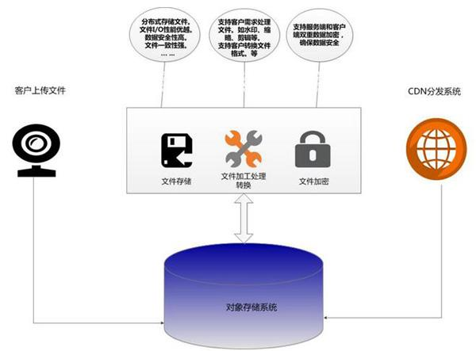
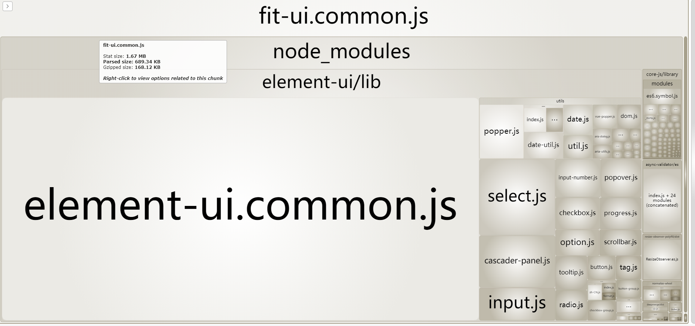
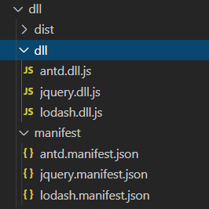

# 前端面试总结

## 前言
最近面试了一些公司，比如滴滴、京东、蚂蚁、头条等，已经拿到了头条和蚂蚁的offer，个人打算应该是要去蚂蚁了。

阿里子弈大佬分享的阿里前端面经很棒，参考下面2篇：

[在阿里我是如何当面试官的（持续更新）](https://juejin.im/post/5e6ebfa86fb9a07ca714d0ec)
<br>
[面试分享：两年工作经验成功面试阿里P6总结](https://juejin.im/post/5d690c726fb9a06b155dd40d)

子弈大佬分享过的问题这里就不赘述了，现将面试中遇到的一些比较好的问题和思路跟大家分享下，希望对大家后续的面试有帮助。

## Q1:CND是什么？CDN的回源机制？CDN与OSS有什么区别？

解题思路:

（1）CDN的定义

CDN的全称是Content Delivery Network，即内容分发网络。
CDN是构建在现有网络基础之上的智能虚拟网络，依靠部署在各地的边缘服务器，通过中心平台的负载均衡、内容分发、调度等功能模块，使用户就近获取所需内容，降低网络拥塞，提高用户访问响应速度和命中率。CDN的关键技术主要有内容存储和分发技术。它的作用是减少传播时延，寻找到最近的节点，典型的“**以空间换时间**”的技术。比如我们访问的淘宝网站的资源大部分都部署到CDN节点上。

举个例子：
<br>
假设某个网站服务器都部署在一个地方（北京），那么全国各地的访问都集中到北京访问。从上海到北京和从香港到北京的延时不一样，而且源站容易负载过大挂掉。
<br>解决的方案是在全国各地多个区域中心部署CDN节点，从香港访问就会从香港的CDN节点返回内容，从南京访问就从南京的CDN节点返回内容，这样可以有效减少传播时延，并且大大降低源站的负载。


CDN的访问过程：


1.当用户点击网站页面上的内容URL，经过本地DNS系统解析，DNS系统会最终将域名的解析权交给CNAME指向的CDN专用DNS服务器。
<br>
2.CDN的DNS服务器将CDN的全局负载均衡设备IP地址返回用户。
<br>
3.用户向CDN的全局负载均衡设备发起内容URL访问请求。
<br>
4.CDN全局负载均衡设备根据用户IP地址，以及用户请求的内容URL，选择一台用户所属区域的区域负载均衡设备，告诉用户向这台设备发起请求。
<br>
5.区域负载均衡设备会为用户选择一台合适的缓存服务器提供服务，选择的依据包括：根据用户IP地址，判断哪一台服务器距用户最近；根据用户所请求的URL中携带的内容名称，判断哪一台服务器上有用户所需内容；查询各个服务器当前的负载情况，判断哪一台服务器尚有服务能力。基于以上这些条件的综合分析之后，区域负载均衡设备会向全局负载均衡设备返回一台缓存服务器的IP地址。
<br>
6.全局负载均衡设备把服务器的IP地址返回给用户。
<br>
7.用户向缓存服务器发起请求，缓存服务器响应用户请求，将用户所需内容传送到用户终端。如果这台缓存服务器上并没有用户想要的内容，而区域均衡设备依然将它分配给了用户，那么这台服务器就要向它的上一级缓存服务器请求内容，直至追溯到网站的源服务器将内容拉到本地。

（2）CDN的回源机制

当 CDN 缓存服务器中没有符合客户端要求的资源的时候，缓存服务器会请求上一级缓存服务器，以此类推，直到获取到。最后如果还是没有，就会回到我们自己的服务器去获取资源。

回源情况：
<br>
1.用户访问时，如节点上无缓存，则会回源拉取资源；
<br>
2.CDN节点上的文件过期，会回源拉取资源；
<br>
3.若为不缓存文件，用户访问时，会直接回源拉取资源。

（3）OSS与CDN区别

OSS:（Object Storage Service，对象存储服务）对象存储将数据通道(需要访问的数据)和控制通路(元数据，即索引)分离，先根据索引(也就是元数据)找到数据存储的位置，进而通过底层的存储接口来访问数据。通过这种方式，对象存储既有类似块存储的存取性能，也有类似文件存储的共享便利，可谓是鱼与熊掌兼得的存储方式。对象存储主要用来存储图片、音频、视频等非结构化数据。

区别：OSS的核心是存储，以及计算能力，CDN的核心是分发，本身不提供存储的接口，所以一般是两者配合使用。对象存储中存储的资源文件，正好适合CDN做加速。对象存储+CDN，已经成为互联网应用的一个必不可少的组成部分。



参考链接：

[CDN是什么？使用CDN有什么优势？](https://www.zhihu.com/question/36514327?rf=37353035)
<br>
[关于CDN、回源等问题一网打尽](https://juejin.im/post/5af46498f265da0b8d41f6a3)
<br>
[OSS对象存储和CDN傻傻分不清？](https://www.solves.com.cn/it/wlyx/fwq/2019-10-24/6598.html)

## Q2.webpack如何打包优化？
解题思路：

先使用*webpack-bundle-analyzer*分析打包后整个项目中的体积结构，既可以看到项目中用到的所有第三方包，又能看到各个模块在整个项目中的占比。



1.按需加载

（1）路由按需加载

Vue中路由懒加载，使用`() => import(xxx.vue)`形式，打包会根据路由自动拆分打包。
```
import VueRouter from 'vue-router'

Vue.use(VueRouter)

export default new VueRouter {
   routes: [
      {
        path: 'a',
        component: () => import('../views/A.vue')
      },
      {
        path: 'b',
        component: () => import('../views/B.vue')
      }
   ]
}
```

React中使用`React.lazy`函数可以像渲染常规组件一样处理动态引入的组件，应在`Suspense`组件中渲染lazy组件，配合路由更高效。
```
import { Switch, Route, Redirect } from 'react-router-dom';

const Home = lazy(() => import('../views/Home));
const About = lazy(() => import('../views/About'));
const WrappedComponent = (component) => {
    return (
        <Suspense fallback={<div>Loading...</div>}>
            {component}
        </Suspense>
    );
};

const Main = () => (
  <Switch>
    <Route path="/home" component={WrappedComponent(Home)} />
    <Route exact path="/about" component={WrappedComponent(About)} />
  </Switch>
);

export default Main;
```
（2）第三方库按需加载

比如使用`lodash`工具库或者`element-ui`组件库时，尽量按需加载，避免把整个库打包到项目中去。
```
// 按需引入lodash需要函数
import get from 'lodash/get';

// 按需引入组件
import { Button } from 'element-ui';
Vue.component(Button.name, Button);
```

2.文件解析优化

loader解析优化：通过配置`include`和`exclude`来减少被处理的文件，还可以配合`cacheDirectory`来缓存编译后的结果。
```
module: {
  rules: [
    {
      test: /\.js$/,
      loader: 'babel-loader?cacheDirectory',
      include: [
        path.resolve(__dirname, 'src')
      ],
      exclude: /node_modules/
    }
  ]
}
```
文件解析优化：通过配置`resolve`选项中的`alias`、`extensions`、`modules`来实现。

alias：创建`import`或`require`的别名，加快webpack查找速度。

extensions：自动解析确定的扩展，默认值为：
```
extensions: [".js", ".json"]
```
使用此选项会覆盖默认数组。webpack按照模块设定的顺序进行解析，将大部分模块的扩展放在数组前面，可以提升查找速度。

modules：解析模块时应该搜索的目录，通常建议使用绝对路径，避免层层查找祖先目录。

```
resolve: {
  alias: {
    '@': path.resolve(__dirname, "src")
  },
  extensions: [".js", ".vue"],
  mainFields: ["index", "main"],
  modules: [path.resolve(__dirname, "src"),"node_modules"]
}
```
3.拆分公共模块

使用splitChunks进行拆包，抽离公共模块。
<br>
splitChunks默认配置如下：
```
splitChunks: {
    // 表示选择哪些 chunks 进行分割，可选值有：async，initial和all
    chunks: "async",
    // 表示新分离出的chunk必须大于等于minSize，默认为30000，约30kb。
    minSize: 30000,
    // 表示一个模块至少应被minChunks个chunk所包含才能分割。默认为1。
    minChunks: 1,
    // 表示按需加载文件时，并行请求的最大数目。默认为5。
    maxAsyncRequests: 5,
    // 表示加载入口文件时，并行请求的最大数目。默认为3。
    maxInitialRequests: 3,
    // 表示拆分出的chunk的名称连接符。默认为~。如chunk~vendors.js
    automaticNameDelimiter: '~',
    // 设置chunk的文件名。默认为true。当为true时，splitChunks基于chunk和cacheGroups的key自动命名。
    name: true,
    // cacheGroups 下可以可以配置多个组，每个组根据test设置条件，符合test条件的模块，就分配到该组。模块可以被多个组引用，但最终会根据priority来决定打包到哪个组中。默认将所有来自 node_modules目录的模块打包至vendors组，将两个以上的chunk所共享的模块打包至default组。
    cacheGroups: {
        vendors: {
            test: /[\\/]node_modules[\\/]/,
            priority: -10
        },
        // 
    default: {
            minChunks: 2,
            priority: -20,
            reuseExistingChunk: true
        }
    }
}
```
总结下来就是：

- 1.被复用代码或者来自`node_moules`文件夹中的模块
- 2.模块的体积大小必须大于等于30kb才进行拆分
- 3.当按需加载chunks时，并行请求的最大数量不能超过5
- 4.初始页面加载时，并行请求的最大数量不能超过3

下面就是把node_modules中的react和moment再进行拆分，避免打包出的vendor包过大。
```
splitChunks: {  
    chunks: 'all',  
    minSize: 30000,
     minChunks: 1,
    cacheGroups: {    
        lib: {      
            name: 'vendors',      
            test: /[\\/]node_modules[\\/]/,      
            priority: 10,      
            chunks: 'initial' // 只打包初始时依赖的第三方    
        },    
       react: {      
            name: 'react', // 单独将 react 拆包      
            priority: 20,
            test: /[\\/]node_modules[\\/]react[\\/]/,      
            chunks: 'all'    
       },
       moment: {
            name: 'moment', //单独将moment拆包
            priority: 20,
            test: /[\\/]node_modules[\\/]moment[\\/]/
       },
       default: {
            minChunks: 2,
            priority: -20,
            reuseExistingChunk: true
        }
    }
}
```
4.DllPlugin和DllReferencePlugin

通常打包过程中，由于第三方库代码不经常改变，我们可以将第三方库的代码跟业务代码抽离。DllPlugin 和 DLLReferencePlugin 可以实现拆分 bundles，并且可以大大提升构建速度，DllPlugin 和 DLLReferencePlugin 都是 webpack 的内置模块。

配置webpack.dll.js，将lodash、jquery、antd抽离出来。
```
const path = require("path");
const webpack = require("webpack");
const {CleanWebpackPlugin} = require("clean-webpack-plugin");

module.exports = {
  mode: "production",
  entry: {
    lodash: ["lodash"],
    jquery: ["jquery"],
    antd: ["antd"]
  },
  output: {
    filename: "[name].dll.js",
    path: path.resolve(__dirname, "dll"),
    library: "[name]" // name和library保持一致
  },
  plugins: [
    new CleanWebpackPlugin(),
    new webpack.DllPlugin({
      name: "[name]",
      path: path.resolve(__dirname, "manifest/[name].manifest.json")
    })
  ]
};
```
配置package.json中，新增script打包dll
```
"scripts": {
  ...,
  "dll": "webpack --config webpack.dll.js"
}
```
执行`npm run dll`，生成dll文件和对应的manifest.json。



将打包的dll通过`add-asset-html-webpack-plugin`添加到html中，再通过DllReferencePlugin把dll引用到需要编译的依赖。

配置`webpack.config.js`：
```
const manifests = ['antd', 'jquery', 'lodash'];
const dllPlugins = manifests.map(item => {
  return new webpack.DllReferencePlugin({
    manifest: require(`./manifest/${item}.manifest`)
  });
});

module.exports = {
  ...,
  plugins: [
    ...dllPlugins,
    new AddAssetHtmlPlugin({
      filepath: path.resolve(__dirname, "./dll/*.dll.js")
    })
  ]
}
```
参考文章：
<br>
[总结几个webpack打包优化的方法](https://juejin.im/post/5ddc8a6be51d4523275838db)
<br>
[将webpack打包优化到极致_20180619](https://juejin.im/post/5d0aea6fe51d4550a629b286)

## Q4.如何实现一套类似vue-cli脚手架？
解题思路：

相关技术：node、webpack、inquire、program、download-git-repo

inquirer

脚手架需要包含3个核心功能：
- 初始化项目；
- 本地开发；
- 本地打包。

1.初始化项目：`xx create <project-name>`

在github上建好项目模板仓库
```
const program = require('program');
const download = require('download-git-repo');

// 注册create命令
program.command('create <project-name>').action((name, cmd) => {
  download('xxx', './', { clone: true }, (err) => {
    
  });
});
```


